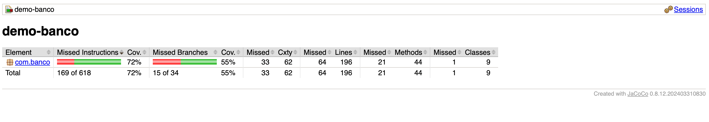
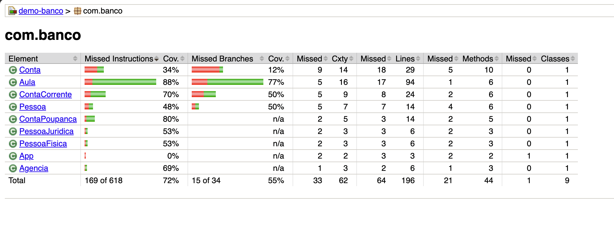

# 🏦 Sistema de Gestão de Contas Bancárias

Este repositório contém a implementação de um sistema simples de **gestão de contas bancárias em Java**, desenvolvido como **atividade final da Disciplina Gestão e Qualidade de Software**. O projeto demonstra e aplica conceitos fundamentais, como:

- Programação Orientada a Objetos (POO)
- Herança, polimorfismo e encapsulamento
- Testes de software com JUnit
- Análise de cobertura de código com JaCoCo
- Refatoração de código


### - Integrantes:


Matheus Lopes Ferreira Leite - RA 1232022908

Klaus Boger - RA 1232020299

Andre Luiz da Silva Junior - RA 1232020446

Sérgio Pinton Pavanelli - RA 123220202

Humberto Belluco Dias Nogueira Machado - RA 1242021491

---

## 📌 Descrição do Programa

O sistema simula um ambiente bancário básico onde o usuário pode **cadastrar clientes** e **criar contas bancárias**.

### Funcionalidades Principais

-   **Cadastro de Pessoas:**
    -   Pessoa Física (com CPF)
    -   Pessoa Jurídica (com CNPJ)
        Ambas herdam de uma classe abstrata `Pessoa`.
-   **Criação de Contas:**
    -   `ContaCorrente` e `ContaPoupanca`, que herdam de `Conta` e implementam a interface `OperacaoBancaria`.
-   **Agências Bancárias:**
    -   As contas são vinculadas a uma das **três agências pré-definidas**.
-   **Operações Bancárias:**
    -   Suporte a **depósito** e **saque** para ambos os tipos de conta.
-   **Geração Automática de Número de Conta:**
    -   Os números das contas são gerados aleatoriamente.
-   **Interface de Console:**
    -   A interação com o usuário é realizada por meio de menus no terminal.

---

## 📘 Atividades Realizadas e Respostas ao Enunciado

Este projeto aborda as atividades propostas no enunciado da disciplina, conforme detalhado abaixo:

### ✅ Implementação de Getters e Setters (Exercício 01, item a)

Foram criados e inclusos métodos `get` e `set` para todos os atributos relevantes das classes do sistema, garantindo o encapsulamento e a manipulação controlada dos dados.

### ✅ Correções e Verificação de Erros (Exercício 01, item b)

Foi realizada uma análise minuciosa do código-fonte fornecido, identificando e corrigindo diversos erros de codificação e lógica que comprometiam o funcionamento do sistema. As principais correções incluíram:
* Ajustes nos construtores das classes para garantir a inicialização correta dos objetos.
* Retornos de métodos adequados aos tipos de dados esperados.
* Ajustes na assinatura da interface `OperacaoBancaria` e sua implementação nas classes de conta.

**Nota:** As evidências visuais (prints de tela ou trechos de código dos problemas identificados e corrigidos) foram documentadas separadamente para entrega da atividade, mas o código final já reflete essas correções.

### 🧪 Plano de Testes, Testes Funcionais e Unitários, e Cobertura de Código (Exercício 01, itens c, d, e):

Para garantir a qualidade e a robustez do sistema, foram implementados testes abrangentes utilizando o framework **JUnit 5**. Estes testes são executados automaticamente pelo Maven e sua cobertura de código é monitorada pelo JaCoCo.

**1. Plano de Testes e Execução de Casos de Teste Funcionais (CTFs)**

Um plano de testes detalhado foi elaborado, e 6 casos de teste funcionais (CTFs) foram implementados na classe `CadastroTest.java`. Estes CTFs simulam a interação do usuário via console, validando o comportamento do sistema de ponta a ponta em cenários chave. As evidências da execução (prints de tela) foram geradas e anexadas à documentação principal da atividade.

* **CTF01: Cadastrar Pessoa Física e Conta Corrente com Depósito Inicial**
    * **Cenário:** Verificação do fluxo completo de cadastro de Pessoa Física, criação de Conta Corrente e depósito inicial.
    * **Resultados Esperados:** Confirmação da agência, dados do cliente e saldo inicial.

* **CTF02: Cadastrar Pessoa Jurídica e Conta Poupança**
    * **Cenário:** Validação do processo de cadastro de Pessoa Jurídica e criação de Conta Poupança com rendimento.
    * **Resultados Esperados:** Confirmação da agência, dados da empresa e saldo inicial na poupança.

* **CTF03: Tentar Sacar Valor Maior que o Saldo Disponível (Conta Corrente)**
    * **Cenário:** Verifica se o sistema impede saques que excedem o saldo disponível.
    * **Resultados Esperados:** Saque não realizado, saldo inalterado e mensagem de erro.

* **CTF04: Tentar Depositar Valor Negativo (Conta Corrente)**
    * **Cenário:** Garante que o sistema rejeita tentativas de depósito com valores negativos.
    * **Resultados Esperados:** Saldo não alterado e mensagem de valor inválido.

* **CTF05: Criar Múltiplas Contas para a Mesma Pessoa Física (Corrente e Poupança)**
    * **Cenário:** Valida a capacidade de criar múltiplos tipos de conta para a mesma pessoa.
    * **Resultados Esperados:** Confirmação da criação de ambas as contas com seus respectivos saldos.

* **CTF06: Tentar Escolher Agência Inexistente e Corrigir**
    * **Cenário:** Testa a resiliência do sistema à entrada de agências inválidas e a recuperação.
    * **Resultados Esperados:** Mensagem de erro para agência inválida, novo prompt e fluxo correto após entrada válida.

**2. Casos de Testes Unitários e Execução**

A classe `CadastroTest.java` contém uma suíte de 6 casos de testes unitários que validam funcionalidades específicas das classes, independentemente da interação com o console. A execução desses testes é parte do ciclo de build do Maven.

**Print da execução dos testes unitários (exibindo o resultado):**
(Para inserir este print, você precisará gerar um que mostre os 6 testes unitários sendo executados e passando, como a saída do Surefire ou da sua IDE)

**3. Cobertura de Código com JaCoCo**

A ferramenta **JaCoCo** foi integrada ao processo de build do Maven para medir a eficácia dos testes implementados, gerando um relatório detalhado em HTML.

**Resultados da Cobertura de Código:**

* **Cobertura de Instruções:** **72% (169 de 618)**
* **Cobertura de Branches:** **55% (15 de 34)**

Esses resultados indicam que a maioria das instruções e ramificações do código estão sendo exercitadas pelos testes, demonstrando uma boa cobertura geral. A cobertura de branches aponta áreas onde cenários adicionais podem ser explorados para aumentar a robustez dos testes.

**Relatório de Cobertura JaCoCo:**





-   O relatório detalhado pode ser gerado via Maven em `target/site/jacoco/index.html`.

### 🛠️ Otimizações e Refatorações (Exercício 01, item f)

Foram realizadas **5 melhorias de código** que se enquadram em técnicas de refatoração, visando aprimorar a legibilidade, manutenibilidade e eficiência do sistema. As otimizações realizadas e seus resultados incluem:

1.  **Extração de Métodos Auxiliares:** Lógica repetitiva e blocos de código grandes foram encapsulados em métodos menores e mais específicos, melhorando a modularidade e a legibilidade.
2.  **Renomeação de Variáveis:** Nomes de variáveis foram padronizados para maior clareza e semântica, facilitando a compreensão do código.
3.  **Remoção de Código Morto:** Partes do código que não eram mais utilizadas ou acessíveis foram removidas, reduzindo a complexidade desnecessária.
4.  **Uso de Operador Ternário:** Condicionais simples foram substituídas pelo operador ternário (`? :`), tornando o código mais conciso em certos contextos.
5.  **Eliminação de Duplicações:** Trechos de código duplicados foram identificados e consolidados em uma única implementação, evitando redundância e facilitando futuras manutenções.

---

## 🎥 Demonstração do Projeto Rodando os Testes

Assista a uma demonstração do projeto rodando os testes e mostrando a execução no console:

[**Vídeo de Demonstração - Rodando os Testes**](https://www.youtube.com/watch?v=fwU9mrCvt2E)

---

## ▶️ Como Executar o Projeto (com Maven)

Este projeto é configurado com Maven. Certifique-se de ter o Maven instalado em sua máquina.

### ⚙️ Por que Maven?

A escolha do **Maven** como ferramenta de automação de build e gerenciamento de projetos para este sistema de gestão bancária foi estratégica e se baseia em diversos benefícios fundamentais para o desenvolvimento de software Java:

* **Padronização de Projetos:** O Maven impõe uma estrutura de diretórios padrão (`src/main/java`, `src/test/java`, `target`, etc.), o que torna o projeto fácil de entender e trabalhar para qualquer desenvolvedor Java.
* **Gerenciamento de Dependências:** Simplifica a inclusão e o gerenciamento de bibliotecas externas (como JUnit), baixando as JARs necessárias automaticamente.
* **Automação de Build:** Define um ciclo de vida de build padrão (clean, compile, test, package, install, deploy), automatizando tarefas e garantindo consistência e reprodutibilidade.
* **Plugins Essenciais:** Utilização de plugins como `maven-compiler-plugin` (compilação), `maven-surefire-plugin` (execução de testes JUnit) e `jacoco-maven-plugin` (geração de relatório de cobertura de código).
* **Documentação e Relatórios:** Facilita a geração de documentação e relatórios importantes, úteis para análise de qualidade.

Em resumo, o Maven atua como a espinha dorsal do projeto, orquestrando as etapas de desenvolvimento de forma organizada, eficiente e padronizada.

### 1. Instalação do Maven

```bash
sudo apt-get install maven
```     

### 2. Compilação e Execução dos Testes

```bash
mvn clean install
``` 

### 3. Execução dos Testes

```bash
mvn test
```

### 4. Relatório de Cobertura JaCoCo

```bash
mvn jacoco:report
```

### 5. Abertura do Relatório de Cobertura JaCoCo

```bash 
open target/site/jacoco/index.html
```     

### 6. Execução do Projeto  


```bash
mvn exec:java   
``` 

### Para clonar o Repositório:

```bash
git clone https://github.com/sergiopavanelli/trabalhoA3
```

### © 2025 Direitos Reservados para fins educacionais.