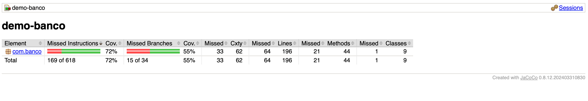

# 🏦 Sistema de Gestão de Contas Bancárias

Este repositório contém a implementação de um sistema simples de **gestão de contas bancárias em Java**.
O projeto foi desenvolvido como atividade final da Disciplina Gestão e Qualidade de Software e demonstra conceitos de:

- Programação Orientada a Objetos (POO)
- Herança, polimorfismo e encapsulamento
- Testes de software com JUnit

---

## 📌 Descrição do Programa

O sistema simula um ambiente bancário básico onde o usuário pode **cadastrar clientes** e **criar contas bancárias**.

### Funcionalidades principais

-   **Cadastro de Pessoas**
    -   Pessoa Física (com CPF)
    -   Pessoa Jurídica (com CNPJ)
        Ambas herdam de uma classe abstrata `Pessoa`.
-   **Criação de Contas**
    -   `ContaCorrente` e `ContaPoupanca`, que herdam de `Conta` e implementam a interface `OperacaoBancaria`.
-   **Agências Bancárias**
    -   As contas são vinculadas a uma das **três agências pré-definidas**.
-   **Operações Bancárias**
    -   Suporte a **depósito** e **saque** para ambos os tipos de conta.
-   **Geração Automática de Número de Conta**
    -   Os números das contas são gerados aleatoriamente.
-   **Interface de Console**
    -   A interação com o usuário é realizada por meio de menus no terminal.

---

## 📘 Atividades Realizadas (Trabalho Final da Disciplina)

### ✅ Implementações e Correções

-   Inclusão de métodos `get` e `set` para os atributos relevantes.
-   Correção de:
    -   Construtores
    -   Retornos de métodos
    -   Assinatura da interface `OperacaoBancaria`

### 🧪 Testes de Software: JUnit e Cobertura de Código (JaCoCo)

Para garantir a qualidade e a robustez do sistema, foram implementados testes abrangentes utilizando o framework **JUnit 5**. Estes testes, focados na validação das funcionalidades principais, são executados automaticamente pelo Maven e sua cobertura de código é monitorada pelo JaCoCo.

**1. Testes Funcionais Detalhados (Implementados na classe `CadastroTest.java` com JUnit 5)**

A classe `CadastroTest.java` contém uma suíte de **6 casos de teste funcionais (CTFs)** que simulam a interação do usuário com a aplicação via entrada/saída de console. O objetivo é validar o comportamento do sistema de ponta a ponta em cenários chave.

* **CTF01: Cadastrar Pessoa Física e Conta Corrente com Depósito Inicial**
    * **Cenário:** Verificação do fluxo completo de cadastro de uma Pessoa Física, criação de uma Conta Corrente associada e confirmação de um depósito inicial.
    * **Passos:**
        1.  Simula a entrada de dados para cadastro de Pessoa Física.
        2.  Simula a entrada de dados para criação de Conta Corrente com depósito.
        3.  Executa o método principal da aplicação (`Aula.main`).
    * **Resultados Esperados:** Confirmação da agência, nome, CPF, perguntas sobre contas e salário, e o saldo inicial de 1000.0.

* **CTF02: Cadastrar Pessoa Jurídica e Conta Poupança**
    * **Cenário:** Validação do processo de cadastro de Pessoa Jurídica e criação de uma Conta Poupança com rendimento configurado.
    * **Passos:**
        1.  Simula a entrada de dados para cadastro de Pessoa Jurídica.
        2.  Simula a entrada de dados para criação de Conta Poupança com rendimento.
        3.  Executa o método principal da aplicação (`Aula.main`).
    * **Resultados Esperados:** Confirmação da agência, nome, CNPJ, perguntas sobre contas e rendimento da poupança, e o saldo inicial de 0.0 na poupança.

* **CTF03: Tentar Sacar Valor Maior que o Saldo Disponível (Conta Corrente)**
    * **Cenário:** Verifica se o sistema impede saques que excedem o saldo disponível na Conta Corrente.
    * **Passos:**
        1.  Instancia uma `ContaCorrente` com saldo limitado.
        2.  Tenta realizar um saque com valor superior ao saldo.
    * **Resultados Esperados:** O saque não deve ser realizado, o saldo da conta deve permanecer inalterado e uma mensagem de saldo insuficiente deve ser exibida.

* **CTF04: Tentar Depositar Valor Negativo (Conta Corrente)**
    * **Cenário:** Garante que o sistema rejeita tentativas de depósito com valores negativos.
    * **Passos:**
        1.  Instancia uma `ContaCorrente`.
        2.  Tenta realizar um depósito com valor negativo.
    * **Resultados Esperados:** O saldo da conta não deve ser alterado e uma mensagem de valor inválido para depósito deve ser exibida.

* **CTF05: Criar Múltiplas Contas para a Mesma Pessoa Física (Corrente e Poupança)**
    * **Cenário:** Valida a capacidade do sistema de criar múltiplos tipos de conta (corrente e poupança) para uma mesma Pessoa Física em uma única sessão.
    * **Passos:**
        1.  Simula a entrada de dados para cadastro de Pessoa Física.
        2.  Simula a criação de Conta Corrente e, em seguida, Conta Poupança, ambos para a mesma pessoa.
        3.  Executa o método principal da aplicação (`Aula.main`).
    * **Resultados Esperados:** Confirmação da criação de ambas as contas com seus respectivos saldos e rendimentos, sem mensagens de erro de agência ou opção inválida.

* **CTF06: Tentar Escolher Agência Inexistente e Corrigir**
    * **Cenário:** Testa a resiliência do sistema à entrada de agências inválidas e a capacidade de se recuperar após a correção do usuário.
    * **Passos:**
        1.  Simula a entrada de uma agência inválida.
        2.  Simula a correção com a entrada de uma agência válida.
        3.  Prossegue com o fluxo de criação de conta (sem criar contas para focar na validação da agência).
        4.  Executa o método principal da aplicação (`Aula.main`).
    * **Resultados Esperados:** Uma mensagem de erro para agência inválida deve ser exibida, o prompt da agência deve aparecer novamente, e o fluxo deve prosseguir corretamente após a entrada válida.

**2. Cobertura de Código com JaCoCo**

A ferramenta **JaCoCo** é integrada ao processo de build do Maven para medir a eficácia dos testes implementados. Ele gera um relatório detalhado em HTML que mostra a porcentagem do código que foi exercitada pelos testes (cobertura de linha, instrução e ramificação).

-   **Relatório gerado via Maven em `target/site/jacoco/index.html`**.

### 🛠️ Otimizações e Refatorações

Foram realizadas **5 melhorias** principais:
1.  **Extração de métodos** auxiliares para lógica repetitiva
2.  **Renomeação de variáveis** para maior clareza
3.  **Remoção de código morto**
4.  **Uso de operador ternário** em substituição a condicionais simples
5.  **Eliminação de duplicações**

---

## ▶️ Como Executar o Projeto (com Maven)

Este projeto é configurado com Maven. Certifique-se de ter o Maven instalado em sua máquina.

### ⚙️ Por que Maven?

A escolha do **Maven** como ferramenta de automação de build e gerenciamento de projetos para este sistema de gestão bancária foi estratégica e se baseia em diversos benefícios fundamentais para o desenvolvimento de software Java:

* **Padronização de Projetos:** O Maven impõe uma estrutura de diretórios padrão (`src/main/java`, `src/test/java`, `target`, etc.), o que torna o projeto fácil de entender e trabalhar para qualquer desenvolvedor Java, independentemente da equipe ou empresa.
* **Gerenciamento de Dependências:** Em projetos Java, é comum usar bibliotecas externas (como JUnit para testes). O Maven simplifica a inclusão e o gerenciamento dessas dependências automaticamente. Ele baixa as JARs necessárias do repositório central Maven e as disponibiliza para o projeto e seus plugins, eliminando a necessidade de gerenciar arquivos JAR manualmente.
* **Automação de Build:** O Maven define um ciclo de vida de build padrão (clean, compile, test, package, install, deploy). Isso permite automatizar tarefas como a compilação do código, a execução dos testes (com JUnit e Surefire) e a geração de relatórios (como o de cobertura de código do JaCoCo) com comandos simples, garantindo consistência e reprodutibilidade do build.
* **Plugins:** O Maven é extensível através de plugins. Para este projeto, utilizamos plugins como:
    * **`maven-compiler-plugin`**: Para compilar o código-fonte Java.
    * **`maven-surefire-plugin`**: Essencial para executar os testes unitários (JUnit) e gerar relatórios de resultados de testes.
    * **`jacoco-maven-plugin`**: Para instrumentar o código, coletar dados de execução dos testes e gerar o relatório de cobertura de código, fornecendo uma métrica crucial sobre a qualidade dos testes.
* **Documentação e Relatórios:** Facilita a geração de documentação e relatórios importantes do projeto (como o relatório JaCoCo de cobertura), que são úteis para análise de qualidade e auditoria.

Em resumo, o Maven atua como a espinha dorsal do projeto, orquestrando as etapas de desenvolvimento de forma organizada, eficiente e padronizada, o que é fundamental para a manutenção e evolução de qualquer software.

### 1. Clone o Repositório

```bash
git clone https://github.com/sergiopavanelli/trabalhoA3


